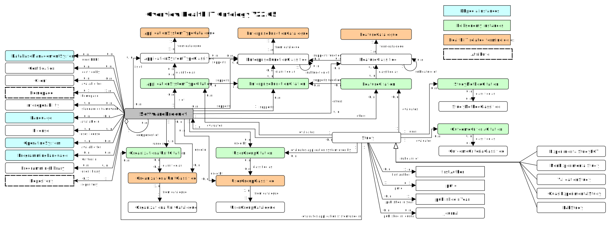

{{ site.description }}

---
## Search
<!--  -->

  <a title="Faceted Search" href="https://hitontology.eu/search/">Search studies
  
</a>

  <a title="Faceted Search" href="https://hitontology.eu/search/softwareproduct.html">
  Search software
  
</a>

 

---
## Other results

  <a title="Browse" href="https://hitontology.eu/ontology/">Browse
  
</a>

  <a title="Ontology Docs" href= "https://hitontology.github.io/ontology/" target="_blank">Ontology Docs
  
</a>

<a title="Feature-Catalogues" href="https://hitontology.eu/ontology/FeatureCatalogue">Feature-Catalogues

</a>

<a title="Function-Catalogues" href="https://hitontology.eu/ontology/EnterpriseFunctionCatalogue">Function-Catalogues

</a>

  <a title="Query" href= "https://hitontology.eu/sparql/">Query
  
</a>

<a title="Download" href="https://raw.githubusercontent.com/hitontology/ontology/master/ontology.ttl">Download  

</a>

  <a title="Glossary" href= "https://imise.github.io/glossar/hito/" target="_blank">Glossary
  
</a>

<a title="Job Ad Builder" href="jobadbuilder/index.html">Job Ad Builder 

</a>

 

---
## Diagrams

---

  
  The HITO diagram

---
