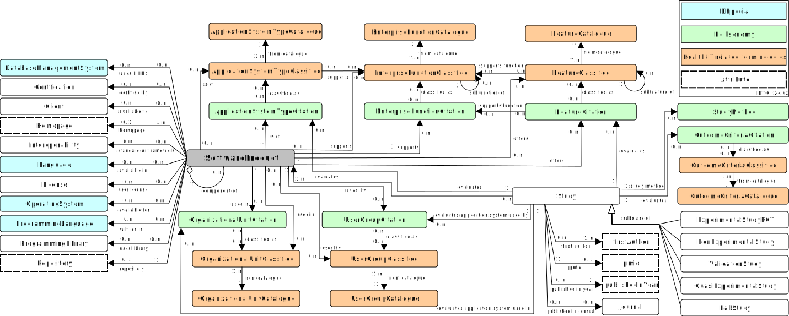

{{ site.description }}

---
## Introduction

There is a variety of libre/free and open-source software (LIFOSS) products for medicine and health care.
The Health Information Technology Ontology (HITO) allows describing those products, as well as studies evaluating them, systematically with a defined set of classes and their relationships.
With the help of linked or integrated catalogues for languages, programming languages, licenses, features, and enterprise functions, the functionalities of LIFOSS can be precisely described and compared.
We publish HITO and the LIFOSS descriptions as Linked Open Data (LOD); they can be queried and viewed using Semantic Web tools, such as an [Resource Description Framework (RDF) browser](https://hitontology.eu/ontology/), [SPARQL queries](https://hitontology.eu/sparql/), and different searches, to serve the use cases given below.

---
## Describe Software

  <a title="Browse" href="https://hitontology.eu/ontology/">Browse
  
</a>

<a title="Feature-Catalogues" href="https://hitontology.eu/ontology/FeatureCatalogue">Feature-Catalogues

</a>

<a title="Function-Catalogues" href="https://hitontology.eu/ontology/EnterpriseFunctionCatalogue">Function-Catalogues

</a>

---
## Search
<!--  -->

  <a title="Path search" href="https://hitontology.github.io/gui/">Path search
  
</a>

  <a title="Faceted Search" href="https://hitontology.eu/search/">Search studies
  
</a>

  <a title="Faceted Search" href="https://hitontology.eu/search/softwareproduct.html">
  Search software
  
</a>

 

---
## Other results

  <a title="Ontology Docs" href= "https://hitontology.github.io/ontology/" target="_blank">Ontology Docs
  
</a>

  <a title="Query" href= "https://hitontology.eu/sparql/">Query
  
</a>

<a title="Download" href="https://raw.githubusercontent.com/hitontology/ontology/master/ontology.ttl">Download  

</a>

  <a title="Glossary" href= "https://imise.github.io/glossar/hito/" target="_blank">Glossary
  
</a>

---
## Diagrams

  
  The HITO diagram

---
## Describe Skills

<a title="Job Ad Builder" href="jobadbuilder/index.html">Job Ad Builder 

</a>

